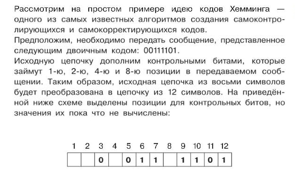

## Observers***

Постройте модель обработки пакета, согласно изложенной логике.

Компоненты модели:

- Функция1(создание пакетов данных) возвращает случайный массив битов данных(целые числа 0 или 1)
- Функция2(подготовка пакетов данных) принимает значение функции1 и возвращает тот же массив вместе с контрольными битами.
- Функция3(передача данных) принимает значение функции2 и случайным образом возвращает поврежденный или не повреждённый массив битов.
- Функция4(валидация пакетов данных) принимает значение функции3 и возвращает булевое значение(целый пакет или нет). Функция4 должна проверять пакет на целостность и если целостность нарушена, пытается восстановить целостность.

Оценивается:
- нейминг
- читаемость
- асимптотическая сложность алгоритмов
- модульность кода